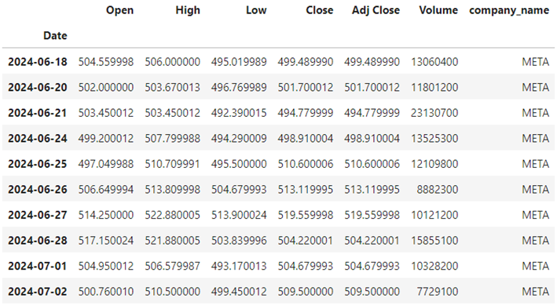
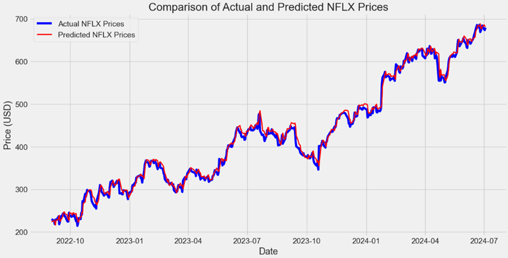
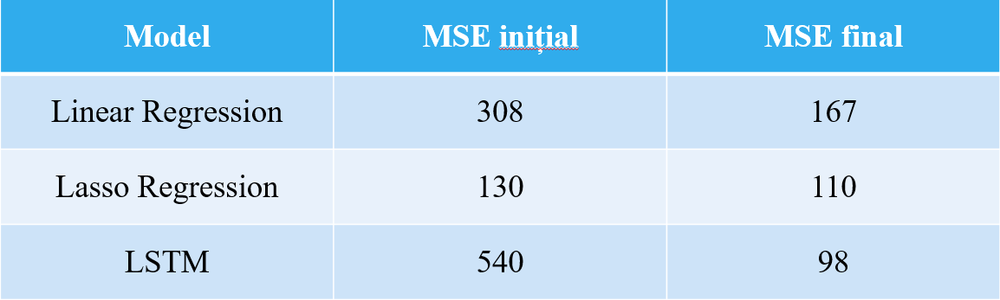

# Netflix Stock Price Prediction based on EDA and Machine Learning

## Introduction
Stock price prediction remains a high-interest research area, enhanced by advances in artificial intelligence. This thesis delves into Netflix's stock behavior, comparing it with FAANG members and other similar content producers like The Walt Disney Company. We explore various machine learning methods to forecast future stock values effectively.

## Research Objectives and Methodology
The primary aim is to predict the stock prices of Netflix Inc by employing machine learning models that utilize historical data from Netflix and other comparative companies. This research seeks to uncover the principal factors driving price dynamics within the tech sector, employing modern methods to explore interactions between major corporations.

## Data Analysis and Model Implementation
We analyzed data from Yahoo Finance, focusing on stock metrics such as opening, closing, highs, lows, and trading volumes. Models were trained using Python with libraries including NumPy, Pandas, Matplotlib, Seaborn, Scikit-learn, and Keras. The LSTM network was highlighted for its efficacy in sequential prediction problems, making it ideal for time-series forecasting like stock prices.

## Results and Evaluation
Model performance was evaluated using Mean Squared Error (MSE) among other metrics. Despite its complexity, the LSTM model showed promise in capturing long-term data dependencies. Comparative analysis indicated that while simple models like Linear and Lasso Regression provided foundational insights, LSTM offered deeper understanding thanks to its deep learning capabilities.

## Possible Improvements
Future enhancements could include:
- Integrating more granular data, such as minute-by-minute price changes.
- Incorporating sentiment analysis from social media and news.
- Exploring advanced neural network architectures like Gated Recurrent Units (GRU) and Transformers to improve prediction accuracy.

## Contributions and Practical Implications
This thesis demonstrates that machine learning significantly enhances the capability to predict stock prices by analyzing historical data to identify non-obvious trends. LSTM models, in particular, show high accuracy potential. The findings contribute to academic insights into financial market predictions via AI and machine learning, offering a robust framework suitable for adaptation in real-time trading systems. These insights are invaluable for financial analysts and investors aiming to make informed decisions.

For more details on this research or to access the data and models used, please refer to the subsequent sections of this repository or contact the repository owner.
